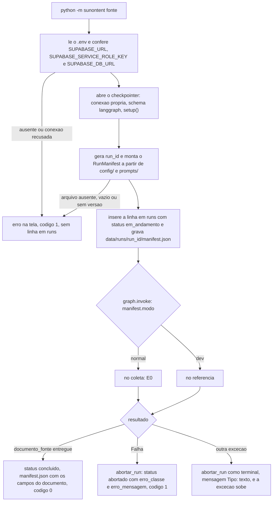

# Fluxo de execução (run)

Este documento descreve como um run começa, como o grafo é montado e executado e como ele termina, concluído ou abortado. A ingestão (E0 e o modo `--dev`) está em `docs/fluxos/ingestao.md`, e o RunManifest, o estado e o checkpoint em `docs/arquiteturas.md`.

## Responsabilidades

| Peça | Papel |
| ---- | ----- |
| `sunontent/__main__.py` | Ponto de entrada (`python -m sunontent [fonte] [--dev]`). Lê o `.env`, confere as credenciais, gera o `run_id`, monta o manifest, registra o run, executa o grafo e fecha o run como `concluido` ou `abortado`. |
| `sunontent/graph.py` | Monta o grafo LangGraph: as duas entradas (E0 ou referência), a constante `K` e `construir_grafo(checkpointer)`. A ordem das etapas fica só aqui. |
| `sunontent/manifesto.py` | Lê `config/` e `prompts/` e devolve o `RunManifest` sem os campos do documento. |
| `sunontent/schemas.py` | `RunManifest`, `PipelineState` e os tipos `Nivel`, `Fonte` e `Modo`. |
| `sunontent/persistencia.py` | Funções do run: `criar_run`, `concluir_run`, `abortar_run`, `gravar_manifest_local`, `criar_repositorio_supabase` e `checkpointer_postgres`. Única porta de gravação no Supabase e em `data/`. |
| `sunontent/nodes/coleta.py` e `sunontent/nodes/referencia.py` | Nós finos das duas entradas. Não tratam erro: a `Falha` sobe até o `__main__.py`. |

## Ciclo de vida do run



1. **Parâmetros.** `fonte` é `copom`, `cvm` ou `b3`. `--dev` escolhe o documento de referência no lugar do download.
2. **Credenciais.** O `.env` da raiz do repositório é carregado e as três variáveis de `.env.example` são conferidas. O banco recebe um `select 1` sem retentativa. Se algo falhar, a execução para com a mensagem na tela e código de saída 1, **sem criar linha em `runs`** e sem chamar `abortar_run`.
3. **Checkpointer.** `PostgresSaver` em conexão própria (`autocommit`, `dict_row`, `search_path = langgraph`). O `setup()` cria as tabelas na primeira execução.
4. **`run_id` e manifest.** O `run_id` tem o formato `<fonte>_<AAAAMMDDTHHMMSSZ>_<6 hex>`, por exemplo `copom_20261006T150000Z_9f2c1a`, e o instante é o mesmo do `timestamp` do manifest. Se a config for inválida, a execução para antes de existir linha em `runs`.
5. **Registro.** `criar_run` insere a linha em `runs` com status `em_andamento` (sem efeito se o `run_id` já existe) e o `manifest.json` local é gravado em seguida.
6. **Execução.** O grafo roda com `thread_id = run_id`. Os recursos vão em `config["configurable"]`: `repositorio`, `raiz_dados` (`data/`), `pasta_referencia` (`tests/fixtures/referencia/`) e, nos testes, `cliente_http`.
7. **Fim.** Concluído ou abortado, como descrito abaixo.

O código de saída é 0 para run concluído e 1 para run abortado ou para erro antes de existir o run.

## O grafo

```
START -> (modo normal) coleta      -> END
      -> (modo dev)    referencia  -> END
```

- A aresta condicional de `START` lê `state.manifest.modo`: `dev` entra pelo nó `referencia`, e `normal` entra pelo nó `coleta` (E0).
- As duas entradas entregam um `DocumentoFonte` em `documento_fonte` e terminam o grafo. As etapas seguintes ainda não existem no grafo.
- `K = 2` é uma constante de `graph.py`. O valor lido no início do run entra no manifest.
- `construir_grafo(checkpointer=None)` aceita qualquer checkpointer do LangGraph. O `__main__.py` passa o `PostgresSaver`, e os testes passam o `InMemorySaver`.
- `PipelineState` tem `run_id`, `manifest` e `documento_fonte`.
- O `thread_id` é o `run_id`. O formato `<run_id>:<celula_id>` vale a partir das células, que ainda não existem.

## Manifest

`manifesto.montar(raiz, run_id, timestamp, modo, fonte, k)` lê estes arquivos da raiz do repositório:

| Campo do manifest | Origem |
| ----------------- | ------ |
| `level_specs` | chave `versao` de `config/levels/<nivel>.yaml`. Se o arquivo traz `nivel`, ele precisa ser igual ao nome do arquivo. |
| `glossario_versao` | chave `versao` de `config/glossario.yaml`. |
| `modelos` | mapa `modelos` de `config/models.yaml` (nó para snapshot). Sem a chave, fica vazio. A chave `versao` é obrigatória. |
| `prompts` | linha `{# versao: N #}` no início de cada `prompts/*.j2`. Template vazio é ignorado e não entra em `prompts` nem em `arquivos_sha256`. Template com conteúdo e sem a linha de versão para o run. |
| `arquivos_sha256` | SHA-256 de cada arquivo lido, com `\r\n` normalizado para `\n`, chaveado pelo caminho relativo com `/`. |
| `K` | constante de `graph.py`. |

`versao` precisa ser um inteiro maior ou igual a 1. Arquivo ausente, YAML inválido, arquivo vazio ou `versao` inválida levantam `FalhaTerminal` com o caminho do arquivo, antes de existir linha em `runs`.

Os campos do documento (`doc_id`, `doc_sha256`, `url_origem`, `coletado_em`, `coleta_id`) começam vazios e são preenchidos quando o `DocumentoFonte` é entregue: em `runs`, pela E0 ou pelo `ingestao/referencia.py`, e no `manifest.json`, no fechamento do run concluído.

## Run concluído

`concluir_run` atualiza `runs` para `status = 'concluido'` com `where run_id = ... and status = 'em_andamento'` e, só depois, regrava o `manifest.json` com os campos do documento. Se o update não alterar exatamente uma linha, a função levanta `FalhaTerminal`.

## Run abortado

Toda `Falha` que sobe do grafo (E0, referência do `--dev`, e as etapas seguintes quando existirem) é registrada por `persistencia.abortar_run(repositorio, raiz_dados, manifest, classe, mensagem)`:

1. A mensagem aparece na tela (stderr) antes de qualquer gravação.
2. Com `com_retentativa`, o `abortar_run` faz o update em `runs`: `status = 'abortado'`, `erro_classe` e `erro_mensagem`, `where run_id = ... and status = 'em_andamento'`. Os campos de documento não são tocados: podem estar vazios se o run abortou antes de a E0 entregar o documento.
3. O mesmo erro é gravado em `data/runs/<run_id>/manifest.json`.
4. O código de saída é 1.

As constraints de `runs` são respeitadas: `status = 'abortado'` se, e somente se, `erro_classe` não é nulo, e `erro_classe` e `erro_mensagem` são nulos juntos. Mensagem vazia vira `sem mensagem`.

| Situação | Resultado |
| -------- | --------- |
| `Falha` (retriável esgotada ou terminal) no grafo | Run `abortado` com `falha.classe` e `falha.mensagem`. |
| Exceção que não é `Falha` (bug) | Run `abortado` como `terminal`, mensagem `NomeDoTipo: texto`, e a exceção sobe com o traceback. |
| Run já `concluido` ou `abortado` | O update não altera nada: o primeiro estado final é mantido. |
| Supabase inacessível no update (retentativas esgotadas) | O erro fica só no `manifest.json`, com `status` `em_andamento`, `erro_classe` e `erro_mensagem` (a mensagem original mais a nota `status não gravado no Supabase`). A linha de `runs` segue `em_andamento`. A falha de gravação não é levantada e não esconde o erro original. |
| Falha antes de existir o run (credencial, conexão, config ou checkpointer) | Mensagem na tela e código 1. Nenhuma linha em `runs` e nenhuma chamada a `abortar_run`. |
| Falha ao gravar o fechamento de um run concluído | Mensagem na tela e código 1. A linha segue `em_andamento` e o `manifest.json` mantém o status gravado no início. |

A classificação dos erros da E0 e do `--dev` está em `docs/fluxos/ingestao.md`, seção "Classificação de erros".

## Arquivos gravados por um run

```
data/runs/<run_id>/manifest.json
```

Contém os campos do `RunManifest` (em JSON) e, ao lado deles, `status`, `erro_classe` e `erro_mensagem`. Só o processo principal grava esse arquivo, sempre num arquivo temporário renomeado no fim, e sempre depois de gravar no Supabase.

## Como rodar

```
pip install -r requirements.txt
cp .env.example .env        # preencher as três variáveis
python -m sunontent                  # modo normal: copom, cvm e b3 em sequência, um run por fonte
python -m sunontent --dev            # as três fontes com o documento de referência, sem download
python -m sunontent copom [--dev]    # só uma fonte
```

Sem a fonte, as três rodam em sequência, cada uma com o seu `run_id`. Se um run abortar, os seguintes continuam e o código de saída é 1. Rode a partir da raiz do repositório. O modo `--dev` precisa de `tests/fixtures/referencia/<fonte>.pdf` e `<fonte>.json`; sem eles, o run é abortado com a mensagem do arquivo ausente.

## Testes

```
python -m pytest
```

`tests/test_main_graph.py` cobre o manifest, a escolha da entrada do grafo, os dois modos e os caminhos de erro: falha da E0, bug, referência ausente, hash divergente, config inválida, Supabase fora no aborto, run concluído não sobrescrito e credenciais ausentes. Os testes usam o repositório em memória (`tests/conftest.py`), o `InMemorySaver` e `tmp_path`; não acessam internet nem o Supabase do site.
