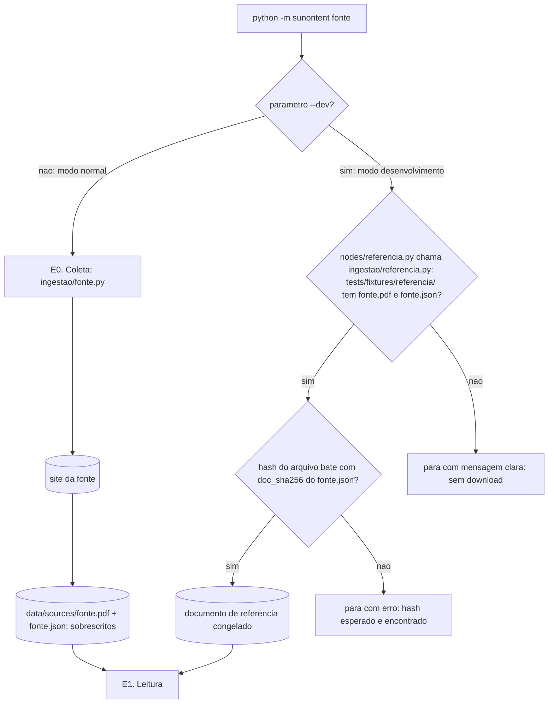

# Fluxo de ingestão (E0. Coleta)

Este documento detalha a etapa E0 do pipeline: como o documento fonte chega até a E1, os dois modos de execução (normal e desenvolvimento), a identificação dos arquivos e a reprodutibilidade. A arquitetura geral está em `docs/arquiteturas.md`.

## Responsabilidade da E0

A E0 tem uma única responsabilidade: **obter o documento mais recente de uma fonte e entregá-lo à E1, junto com a sua identificação.**

- Baixa só a publicação mais recente. Não há histórico nem backfill.
- Baixa o documento inteiro para a memória, valida e calcula o `doc_sha256` antes de gravar qualquer coisa em disco.
- Só então salva o arquivo em `data/sources/`, sobrescrevendo o anterior da mesma fonte.
- **Não** extrai texto, não faz parsing de tabela e não converte números. Isso é trabalho da E1 (`extracao/`).

Fontes atendidas:

| Fonte                 | Script                          | `tipo_documento`     |
| --------------------- | ------------------------------- | ---------------------- |
| Copom (Banco Central) | `sunontent/ingestao/copom.py` | `copom_ata`          |
| CVM                   | `sunontent/ingestao/cvm.py`   | `cvm_fato_relevante` |
| B3                    | `sunontent/ingestao/b3.py`    | `b3_release`         |

O documento baixado é sempre um PDF, nas três fontes. A forma de validar o formato fica em **Pendências**.

## Onde cada peça vive

| Peça                             | Papel                                                                                                                   |
| --------------------------------- | ----------------------------------------------------------------------------------------------------------------------- |
| `sunontent/__main__.py`         | Ponto de entrada (`python -m sunontent`). Lê os parâmetros e escolhe qual das duas entradas do grafo usar. Não lê nem valida a referência. |
| `sunontent/graph.py`            | Monta o grafo, a ordem E0 -> E1 -> E2 -> ... e as duas entradas: pela E0 (modo normal) ou pelo nó `nodes/referencia.py` (modo desenvolvimento), ambas seguidas da E1. |
| `sunontent/nodes/coleta.py`     | Nó fino da E0: chama o script da fonte escolhida em `ingestao/` e coloca o `DocumentoFonte` devolvido no estado.  |
| `sunontent/nodes/referencia.py` | Nó fino da entrada do modo desenvolvimento: chama `ingestao/referencia.py` e coloca o `DocumentoFonte` devolvido no estado. |
| `sunontent/ingestao/<fonte>.py` | Um script por fonte. Baixa, salva, calcula o hash, grava o `.json` de metadados e devolve um `DocumentoFonte`. |
| `sunontent/ingestao/referencia.py` | Modo desenvolvimento: verifica se o documento e o `.json` de referência existem, lê os dois, confere o `doc_sha256` e devolve um `DocumentoFonte`, o mesmo tipo do modo normal. |
| `sunontent/schemas.py`          | Define o `DocumentoFonte`: contrato entre a E0 e a E1 nos dois modos (ver **Contrato de saída**).                      |
| `data/sources/`                 | Último download de cada fonte. Fora do git.                                                                            |
| `tests/fixtures/referencia/`    | Documento congelado de cada fonte, usado no modo desenvolvimento e nos testes. Versionado no git.                       |
| `tests/fixtures/http/<fonte>/`  | Respostas HTTP simuladas de cada fonte para os testes da E0, exceto o corpo do documento (ver **Testes**). Versionado no git. |

Nenhum nó importa outro nó: a passagem da E0 ou do nó de referência para a E1 acontece só pelas arestas do `graph.py`.

## Os dois modos de execução



### Modo normal

```
python -m sunontent copom
```

É o modo de uso real do produto: quem usa quer sempre a informação mais recente.

1. O `__main__.py` inicia o grafo pela E0.
2. A E0 executa `ingestao/copom.py`, que localiza a publicação mais recente e baixa o documento inteiro **para a memória**, sem tocar no disco.
3. Ainda em memória, o script confere o limite de 60 MB, valida o formato e calcula o `doc_sha256`. Se qualquer verificação falhar, o run aborta e `data/sources/` fica intacto.
4. Só se tudo deu certo, o script grava primeiro `data/sources/copom.pdf` e depois `data/sources/copom.json` com os metadados da coleta (ver **Arquivo de metadados**), sobrescrevendo os anteriores.
5. O script devolve um `DocumentoFonte` com o caminho do arquivo e os metadados, e é esse objeto que a E1 recebe.

Não há suporte a arquivo colocado à mão neste modo: a entrada é sempre o download.

Se o processo morrer entre a gravação do documento e a do `.json`, `data/sources/` fica com o documento novo e o `.json` anterior. A janela é de milissegundos e esse risco é aceito: o `doc_sha256` do `.json` não bate com o arquivo, o que torna o par inconsistente detectável.

### Modo desenvolvimento

```
python -m sunontent copom --dev
```

É o modo de desenvolvimento e avaliação: a entrada precisa ser fixa para que runs diferentes sejam comparáveis.

1. O `__main__.py` escolhe a entrada do modo desenvolvimento: a E0 **não** é executada.
2. O nó `nodes/referencia.py` chama o `ingestao/referencia.py`, que lê `tests/fixtures/referencia/copom.pdf` e `tests/fixtures/referencia/copom.json`.
3. Se algum dos dois arquivos não existir, a execução **para** com uma mensagem clara dizendo qual arquivo falta e onde ele deveria estar. O pipeline nunca faz download como alternativa neste modo.
4. O `ingestao/referencia.py` calcula o SHA-256 dos bytes do documento de referência e compara com o `doc_sha256` do `.json`. Se não bater, a execução **para** com erro terminal, indicando o arquivo, o hash esperado e o hash encontrado. O `.json` de referência nunca é corrigido automaticamente: a referência só muda pelo procedimento de congelamento.
5. O `ingestao/referencia.py` devolve um `DocumentoFonte` com o caminho do documento de referência e os metadados do `.json`. O nó `nodes/referencia.py` coloca esse objeto no estado, e é ele que a E1 recebe.

A partir da E1, o pipeline não sabe em qual modo está: os dois modos entregam um `DocumentoFonte`.

## Arquivo de metadados

Toda coleta grava, ao lado do documento, um `.json` com o mesmo nome da fonte:

```json
{
  "doc_id": "copom_ata_273",
  "doc_sha256": "9f2c...e41a",
  "url_origem": "https://...",
  "coletado_em": "2026-10-03T14:22:05-03:00"
}
```

| Campo           | Significado                                                     |
| --------------- | --------------------------------------------------------------- |
| `doc_id`      | Qual publicação é. Legível.                                 |
| `doc_sha256`  | Qual versão exata do arquivo. Hash SHA-256 dos bytes baixados. |
| `url_origem`  | De onde o arquivo foi baixado.                                  |
| `coletado_em` | Quando o arquivo foi baixado de verdade.                        |

No modo desenvolvimento, esses valores vêm do `.json` de referência, e o `doc_sha256` é conferido contra os bytes do documento a cada run. Por isso `coletado_em` registra a data em que aquele documento de referência foi baixado, e não a data do run.

## Contrato de saída: `DocumentoFonte`

A E0 (modo normal) e o `ingestao/referencia.py` (modo desenvolvimento) devolvem o mesmo tipo, definido em `sunontent/schemas.py`:

| Campo           | Origem                                                    |
| --------------- | --------------------------------------------------------- |
| `caminho`     | Caminho do documento: `data/sources/` ou `tests/fixtures/referencia/`. |
| `doc_id`      | Igual ao `.json`.                                         |
| `doc_sha256`  | Igual ao `.json`.                                         |
| `url_origem`  | Igual ao `.json`.                                         |
| `coletado_em` | Igual ao `.json`.                                         |

- Durante o run, a fonte da verdade é o `DocumentoFonte`, não o `.json` em disco. Os nós `coleta.py` e `referencia.py` só colocam o objeto no estado; nenhuma etapa relê o `.json`.
- O `.json` guarda os quatro campos de metadados do `DocumentoFonte`. O `caminho` não é gravado, porque é o próprio arquivo ao lado do `.json`.
- No modo normal, o script monta o `DocumentoFonte` primeiro e grava o `.json` a partir dele.
- O mesmo objeto alimenta os campos de documento do RunManifest.

## Identificação do documento: `doc_id` e `doc_sha256`

Os dois campos respondem perguntas diferentes e por isso coexistem no RunManifest:

- **`doc_id` identifica a publicação.** Exemplo: `copom_ata_273`. É o que uma pessoa e o dashboard usam para agrupar runs ("todos os runs da ata 273").
- **`doc_sha256` identifica a versão do arquivo.** Se a fonte republica um documento corrigido, o `doc_id` continua o mesmo e o hash muda.

Dois runs com o mesmo `doc_id` e hashes diferentes processaram arquivos diferentes e não são comparáveis diretamente. Sem o hash, essa diferença seria invisível.

O formato do `doc_id` por fonte fica em **Pendências**: Copom tem número de reunião, mas CVM e B3 precisam de outro identificador.

## Documento de referência

Existe **um documento de referência por fonte**, em `tests/fixtures/referencia/`:

```
tests/fixtures/referencia/
├── copom.pdf
├── copom.json
├── copom.anotacao.yaml
├── cvm.pdf
├── cvm.json
├── cvm.anotacao.yaml
├── b3.pdf
├── b3.json
└── b3.anotacao.yaml
```

- **`<fonte>.pdf` e `<fonte>.json`:** o documento congelado e seus metadados.
- **`<fonte>.anotacao.yaml`:** a lista, escrita à mão, dos fatos que a E2 tem que extrair daquele documento. É a base do teste de cobertura da E2.

O mesmo documento serve ao modo desenvolvimento, ao teste de cobertura da E2 e como corpo do download simulado nos testes da E0: não existe um segundo documento de teste para manter.

### Como congelar um documento

A troca do documento de referência é manual e intencional:

1. Rode o modo normal para a fonte desejada.
2. Copie **os dois arquivos** de `data/sources/` (`<fonte>.pdf` e `<fonte>.json`) para `tests/fixtures/referencia/`.
3. Atualize `<fonte>.anotacao.yaml` para o novo documento.
4. Atualize a resposta de listagem em `tests/fixtures/http/<fonte>/` para apontar para a nova publicação, de modo que o teste da E0 continue chegando ao `doc_id` do novo `<fonte>.json`.
5. Versione no git.

Não há conferência própria no congelamento: o primeiro run `--dev` depois de congelar confere o hash e para se o par copiado estiver inconsistente.

Como o documento de referência fica no git, o documento anterior continua recuperável pelo histórico.

Os documentos de referência são protegidos contra conversão de quebra de linha pelo `.gitattributes` na raiz do repositório (`*.pdf` como `binary` em `tests/fixtures/referencia/`). Sem isso, o git poderia tratar um PDF como texto e converter quebras de linha no checkout em Windows, e o hash deixaria de bater.

## Reprodutibilidade

Os dois modos atendem necessidades opostas, e cada um resolve a sua:

|               | Modo normal                                     | Modo desenvolvimento                         |
| ------------- | ----------------------------------------------- | -------------------------------------------- |
| Para quem     | Uso do produto                                  | Desenvolvimento e avaliação                |
| Entrada       | Sempre a publicação mais recente              | Sempre o mesmo documento                     |
| Arquivo       | `data/sources/`, sobrescrito, fora do git     | `tests/fixtures/referencia/`, fixo, no git |
| Reprodutível | Não: o documento muda a cada nova publicação | Sim, em qualquer máquina com o repositório |

No modo normal, a reprodutibilidade não é objetivo: o produto quer a informação mais atual. O RunManifest ainda registra `doc_id`, `doc_sha256`, `url_origem` e `coletado_em`, de modo que sempre se sabe **qual** documento foi processado, mesmo que o arquivo já tenha sido sobrescrito.

No modo desenvolvimento, documento, hash e metadados são fixos e versionados, e o hash é conferido a cada run. Junto com o restante do RunManifest (modelos, prompts, LevelSpec, glossário e `K`), isso permite comparar runs e atribuir uma diferença de resultado ao que de fato mudou.

## Requisitos dos scripts de `ingestao/`

- `User-Agent` definido explicitamente.
- Retentativa com backoff exponencial para falhas de conexão.
- Baixam o documento inteiro para a memória, com limite de 60 MB. Nada é gravado em disco antes da validação de formato e do cálculo do `doc_sha256`.
- Gravam primeiro o documento e depois o `.json`.
- Montam um `DocumentoFonte` (ver **Contrato de saída**), gravam o `.json` de metadados a partir dele e o devolvem.
- Usam a ferramenta mais leve que a fonte permitir: cliente HTTP direto quando há URL ou API acessível, e navegador automatizado só se a página depender de renderização pesada de JavaScript.

## Testes

- Nenhum teste acessa a internet. As respostas HTTP das fontes são simuladas.
- `tests/fixtures/http/<fonte>/` guarda as respostas simuladas de cada fonte: a resposta que lista as publicações e a página de erro usada no teste de formato inválido. Timeout, erro de conexão e códigos HTTP são simulados no próprio teste, sem arquivo.
- O corpo do documento simulado são os bytes de `tests/fixtures/referencia/<fonte>.pdf`. Assim o teste da E0 confere de ponta a ponta que o `doc_sha256` e o `doc_id` calculados são iguais aos de `tests/fixtures/referencia/<fonte>.json`.
- O teste de cobertura da E2 usa o documento e a anotação de `tests/fixtures/referencia/`.

```
tests/fixtures/
├── referencia/          # documento congelado, metadados e anotação de cada fonte
└── http/
    ├── copom/           # respostas simuladas da fonte, exceto o documento
    ├── cvm/
    └── b3/
```

## Classificação de erros

| Situação                                                                                              | Classe     | Comportamento                                                                       |
| ------------------------------------------------------------------------------------------------------- | ---------- | ----------------------------------------------------------------------------------- |
| Timeout, erro de conexão, HTTP 5xx, HTTP 429                                                           | Retriável | Retentativa com backoff exponencial; esgotadas as tentativas, vira terminal.        |
| HTTP 404 ou publicação não localizada na página da fonte                                            | Terminal   | Aborta o run com mensagem indicando a fonte e a URL.                                |
| Conteúdo baixado não corresponde ao formato esperado (ex: página de erro HTML no lugar do documento) | Terminal   | Aborta o run sem gravar nada em `data/sources/`.                                    |
| Documento baixado maior que 60 MB                                                                       | Terminal   | Aborta o run sem gravar nada em `data/sources/`, com mensagem indicando a fonte, a URL e o tamanho. |
| Falha ao gravar em `data/sources/` (ex: arquivo aberto em outro programa, disco cheio)                 | Terminal   | Aborta o run com mensagem indicando o arquivo e a causa. Se o arquivo estiver em uso, a mensagem pede para fechá-lo (ex: "feche o arquivo `data/sources/copom.pdf`"). |
| Modo desenvolvimento sem`<fonte>.pdf` ou `<fonte>.json` em `tests/fixtures/referencia/`         | Terminal   | Para com mensagem clara indicando o arquivo ausente. Sem download como alternativa. |
| Modo desenvolvimento com hash do documento diferente do `doc_sha256` do `<fonte>.json`               | Terminal   | Para com mensagem indicando o arquivo, o hash esperado e o hash encontrado. O `.json` não é corrigido automaticamente. |

Todos os erros desta tabela vêm de `ingestao/`: os cinco primeiros dos scripts por fonte, no modo normal, e os dois últimos do `ingestao/referencia.py`, no modo desenvolvimento. Em ambos os casos o erro acontece antes de existir qualquer célula, então ele aborta o run do documento inteiro. Não é o estado `ERRO_INFRA`, que é por célula.

## Pendências

- Como validar que o arquivo baixado é um PDF (ex: primeiros bytes `%PDF-`, `Content-Type` da resposta HTTP ou os dois).
- Formato do `doc_id` para cada fonte.
