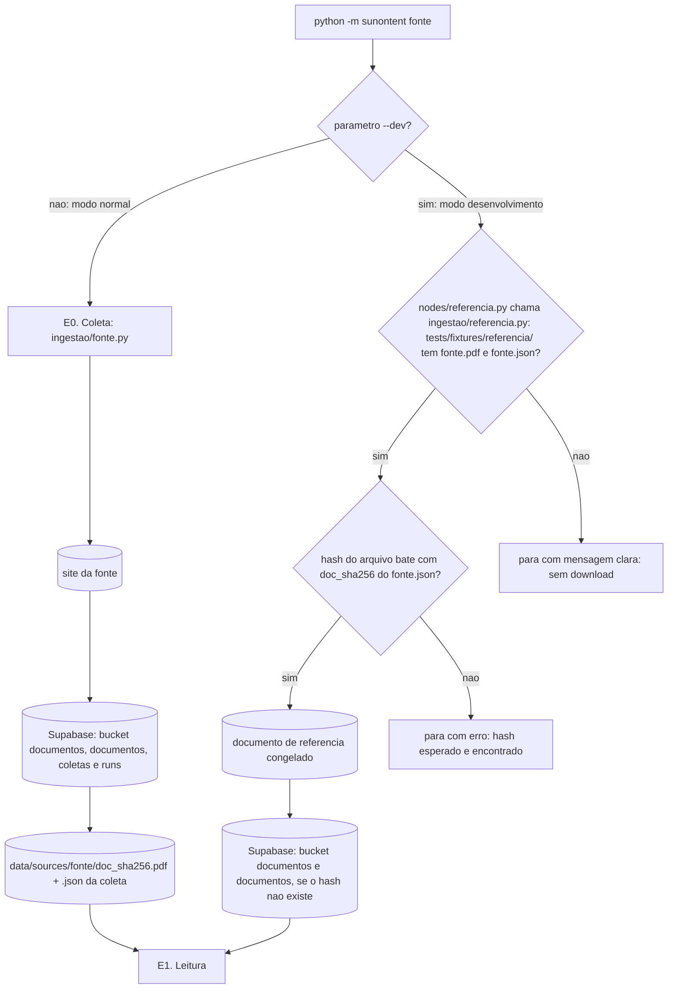

# Fluxo de ingestão (E0. Coleta)

Este documento detalha a etapa E0 do pipeline: como o documento fonte chega até a E1, os dois modos de execução (normal e desenvolvimento), a identificação dos arquivos e a reprodutibilidade. A arquitetura geral está em `docs/arquiteturas.md`.

## Responsabilidade da E0

A E0 tem uma única responsabilidade: **obter o documento mais recente de uma fonte, registrá-lo no Supabase e entregá-lo à E1, junto com a sua identificação.**

- Baixa só a publicação mais recente. Não há histórico nem backfill.
- Baixa o documento inteiro para a memória, valida e calcula o `doc_sha256`. Só depois disso grava alguma coisa, no Supabase ou em disco.
- Grava primeiro no Supabase, que é a fonte da verdade: o PDF no bucket `documentos`, em `<fonte>/<doc_sha256>.pdf`, e, numa única transação, as linhas de `documentos` e `coletas` e o vínculo da coleta com o run em `runs`.
- Em seguida grava a cópia local em `data/sources/<fonte>/`: o PDF `<doc_sha256>.pdf`, só se ainda não existe, e um `.json` por coleta.
- **Não** extrai texto, não faz parsing de tabela e não converte números. Isso é trabalho da E1 (`extracao/`).

Fontes atendidas:

| Fonte                 | Script                          | `tipo_documento`     |
| --------------------- | ------------------------------- | ---------------------- |
| Copom (Banco Central) | `sunontent/ingestao/copom.py` | `copom_ata`          |
| CVM                   | `sunontent/ingestao/cvm.py`   | `cvm_fato_relevante` |
| B3                    | `sunontent/ingestao/b3.py`    | `b3_release`         |

O documento baixado é sempre um PDF, nas três fontes. O formato é validado só pelos primeiros bytes (`%PDF-`): o `Content-Type` da resposta é ignorado, porque a CVM serve o PDF como `text/html`. O PDF vai ao bucket sempre como `application/pdf`.

Como cada script localiza a publicação mais recente:

| Fonte | Listagem | PDF |
| ----- | -------- | --- |
| Copom | API JSON do site do Banco Central: `api/servico/sitebcb/copom/atas?quantidade=1` devolve o número da última reunião, e `atas_detalhes?nro_reuniao=<n>` devolve a URL do PDF. | `urlPdfAta` |
| CVM | Conjunto de dados aberto IPE (`dados.cvm.gov.br`, um ZIP por ano com um CSV em latin-1). Filtra a categoria `Fato Relevante` e escolhe a maior `Data_Entrega`, com desempate pelo `numProtocolo`. Se o ZIP do ano corrente não existe (HTTP 404), usa o do ano anterior. | `Link_Download` (RAD/ENET) |
| B3 | API de arquivos da MZIQ usada pelo site de RI da B3 S.A. (`ri.b3.com.br`), categoria `central_de_resultados_release_de_resultados`, idioma `pt_BR`. Escolhe a maior data de publicação. | `link_url` ou `permalink` |

## Onde cada peça vive

| Peça                             | Papel                                                                                                                   |
| --------------------------------- | ----------------------------------------------------------------------------------------------------------------------- |
| `sunontent/__main__.py`         | Ponto de entrada (`python -m sunontent`). Lê os parâmetros, confere as credenciais do Supabase do `.env` (variáveis em `.env.example`), gera o `run_id`, registra o run em `runs` e escolhe qual das duas entradas do grafo usar. Credencial ausente ou conexão recusada para a execução sem criar linha em `runs`. Não lê nem valida a referência. |
| `sunontent/graph.py`            | Monta o grafo, a ordem E0 -> E1 -> E2 -> ... e as duas entradas: pela E0 (modo normal) ou pelo nó `nodes/referencia.py` (modo desenvolvimento), ambas seguidas da E1. |
| `sunontent/nodes/coleta.py`     | Nó fino da E0: chama o script da fonte escolhida em `ingestao/` e coloca o `DocumentoFonte` devolvido no estado.  |
| `sunontent/nodes/referencia.py` | Nó fino da entrada do modo desenvolvimento: chama `ingestao/referencia.py` e coloca o `DocumentoFonte` devolvido no estado. |
| `sunontent/ingestao/<fonte>.py` | Um script por fonte. Baixa, valida e calcula o hash, grava no Supabase (bucket `documentos`, `documentos`, `coletas` e o vínculo em `runs`), grava a cópia local em `data/sources/<fonte>/` (PDF e `.json` da coleta) e devolve um `DocumentoFonte`. |
| `sunontent/ingestao/referencia.py` | Modo desenvolvimento: verifica se o documento e o `.json` de referência existem, lê os dois, confere o `doc_sha256`, registra o documento no Supabase se ainda não estiver lá e devolve um `DocumentoFonte`, o mesmo tipo do modo normal. |
| `sunontent/schemas.py`          | Define o `DocumentoFonte`: contrato entre a E0 e a E1 nos dois modos (ver **Contrato de saída**).                      |
| `data/sources/`                 | Cópia local dos documentos baixados, um PDF por `doc_sha256` e um `.json` por coleta, em `data/sources/<fonte>/`. Fora do git. A fonte da verdade é o Supabase.                                                                            |
| `tests/fixtures/referencia/`    | Documento congelado de cada fonte, usado no modo desenvolvimento e nos testes. Versionado no git.                       |
| `tests/fixtures/http/<fonte>/`  | Respostas HTTP simuladas de cada fonte para os testes da E0, exceto o corpo do documento (ver **Testes**). Versionado no git. |

Nenhum nó importa outro nó: a passagem da E0 ou do nó de referência para a E1 acontece só pelas arestas do `graph.py`.

## Os dois modos de execução



### Modo normal

```
python -m sunontent copom
```

É o modo de uso real do produto: quem usa quer sempre a informação mais recente.

1. O `__main__.py` confere as credenciais do Supabase, gera o `run_id`, registra o run em `runs` com status `em_andamento` e inicia o grafo pela E0.
2. A E0 executa `ingestao/copom.py`, que localiza a publicação mais recente e baixa o documento inteiro **para a memória**, sem tocar no disco.
3. Ainda em memória, o script confere o limite de 50 MiB (52.428.800 bytes), valida o formato e calcula o `doc_sha256`. Se qualquer verificação falhar, o run termina com status `abortado`, sem nada no bucket, em `documentos`, em `coletas` nem em `data/sources/`.
4. Só se tudo deu certo, o script grava no Supabase, nesta ordem:
   1. Se o `doc_sha256` ainda não está em `documentos`, envia o PDF ao bucket `documentos` em `copom/<doc_sha256>.pdf`, sem `upsert`. Se o objeto já existe (HTTP 400 "Asset Already Exists"), ele é o mesmo arquivo, porque o caminho é o hash, e é reaproveitado.
   2. Numa única transação, insere a linha em `documentos` (sem efeito se o hash já existe), insere a linha em `coletas` e grava em `runs` o `doc_id`, o `doc_sha256`, o `coleta_id`, a `url_origem` e o `coletado_em` devolvidos pelo insert da coleta.
5. Em seguida o script grava a cópia local: `data/sources/copom/<doc_sha256>.pdf`, só se ainda não existe (arquivo temporário renomeado no fim), e `data/sources/copom/<doc_sha256>.<AAAAMMDDTHHMMSSZ>.json` com os metadados da coleta (ver **Arquivo de metadados**).
6. O script devolve um `DocumentoFonte` com o caminho local do arquivo, os metadados e o `coleta_id`, e é esse objeto que a E1 recebe.

Não há suporte a arquivo colocado à mão neste modo: a entrada é sempre o download.

Apagar arquivos de `data/sources/` não perde nada: o Supabase guarda todos os documentos e coletas, e a próxima coleta de um documento grava de novo o PDF local que falta.

Se o processo morrer no meio da gravação, a linha do run fica com status `em_andamento` e o que já foi gravado continua válido:

- Entre o envio ao bucket e a transação: o objeto fica no bucket sem linha em `documentos`. A próxima coleta do mesmo arquivo encontra o objeto ("Asset Already Exists") e o reaproveita.
- Entre a transação e a cópia local: o Supabase tem o documento e a coleta, e falta a cópia local. A próxima coleta do mesmo arquivo grava o PDF local.
- Entre o PDF local e o `.json`: falta o `.json` daquela coleta, cujos metadados estão em `coletas`.

O PDF local nunca fica pela metade, porque é gravado num arquivo temporário e renomeado no fim.

### Modo desenvolvimento

```
python -m sunontent copom --dev
```

É o modo de desenvolvimento e avaliação: a entrada precisa ser fixa para que runs diferentes sejam comparáveis.

1. O `__main__.py` confere as credenciais do Supabase, gera o `run_id`, registra o run em `runs` e escolhe a entrada do modo desenvolvimento: a E0 **não** é executada.
2. O nó `nodes/referencia.py` chama o `ingestao/referencia.py`, que lê `tests/fixtures/referencia/copom.pdf` e `tests/fixtures/referencia/copom.json`.
3. Se algum dos dois arquivos não existir, a execução **para** com uma mensagem clara dizendo qual arquivo falta e onde ele deveria estar. O pipeline nunca faz download como alternativa neste modo.
4. O `ingestao/referencia.py` calcula o SHA-256 dos bytes do documento de referência e compara com o `doc_sha256` do `.json`. Se não bater, a execução **para** com erro terminal, indicando o arquivo, o hash esperado e o hash encontrado. O `.json` de referência nunca é corrigido automaticamente: a referência só muda pelo procedimento de congelamento.
5. O `ingestao/referencia.py` procura o `doc_sha256` em `documentos`. Se não houver linha, envia o PDF ao bucket `documentos` em `<fonte>/<doc_sha256>.pdf`, sem `upsert` (um objeto já existente é reaproveitado), e insere a linha. Nenhuma linha é gravada em `coletas`, porque não houve download.
6. O `ingestao/referencia.py` devolve um `DocumentoFonte` com o caminho do documento de referência e os metadados do `.json`. O nó `nodes/referencia.py` coloca esse objeto no estado, e é ele que a E1 recebe.

A partir da E1, nenhuma etapa decide nada pelo modo: os dois modos entregam um `DocumentoFonte`, e o modo fica registrado só no RunManifest.

## Arquivo de metadados

Toda coleta grava, na pasta do documento, um `.json` próprio, `<doc_sha256>.<coletado_em>.json`, com `coletado_em` em UTC no formato `AAAAMMDDTHHMMSSZ`. Várias coletas do mesmo documento geram vários `.json` ao lado de um único PDF. Os mesmos campos ficam na linha da coleta no Supabase (`coletas`):

```json
{
  "doc_id": "copom_ata_273",
  "doc_sha256": "9f2c...e41a",
  "url_origem": "https://...",
  "coletado_em": "2026-10-03T17:22:05Z"
}
```

| Campo           | Significado                                                     |
| --------------- | --------------------------------------------------------------- |
| `doc_id`      | Qual publicação é. Legível.                                 |
| `doc_sha256`  | Qual versão exata do arquivo. Hash SHA-256 dos bytes baixados. |
| `url_origem`  | De onde o arquivo foi baixado: a URL que devolveu os bytes do PDF, não a da página de listagem. |
| `coletado_em` | Quando o arquivo foi baixado de verdade, em UTC (`AAAA-MM-DDTHH:MM:SSZ`). |

No modo desenvolvimento, esses valores vêm do `.json` de referência, e o `doc_sha256` é conferido contra os bytes do documento a cada run. Por isso `coletado_em` registra a data em que aquele documento de referência foi baixado, e não a data do run.

## Contrato de saída: `DocumentoFonte`

A E0 (modo normal) e o `ingestao/referencia.py` (modo desenvolvimento) devolvem o mesmo tipo, definido em `sunontent/schemas.py`:

| Campo           | Origem                                                    |
| --------------- | --------------------------------------------------------- |
| `caminho`     | Caminho local do documento: `data/sources/<fonte>/<doc_sha256>.pdf` ou `tests/fixtures/referencia/<fonte>.pdf`. A E1 confere o SHA-256 dos bytes lidos contra `doc_sha256`. O original fica no bucket `documentos` em `<fonte>/<doc_sha256>.pdf`, derivável de fonte e hash. |
| `doc_id`      | Igual ao `.json`.                                         |
| `doc_sha256`  | Igual ao `.json`.                                         |
| `url_origem`  | Igual ao `.json`.                                         |
| `coletado_em` | Igual ao `.json`.                                         |
| `coleta_id`   | Id da linha em `coletas` devolvido pelo insert da E0. Vazio no modo desenvolvimento. |

- Durante o run, a fonte da verdade é o `DocumentoFonte`, não o `.json` em disco. Os nós `coleta.py` e `referencia.py` só colocam o objeto no estado; nenhuma etapa relê o `.json`.
- O `.json` guarda `doc_id`, `doc_sha256`, `url_origem` e `coletado_em`. O `caminho` não é gravado, porque é o PDF da mesma pasta com o mesmo `doc_sha256`. O `coleta_id` também não é gravado: ele identifica a linha no Supabase e não vale para o documento de referência.
- No modo normal, o script monta o `DocumentoFonte` primeiro e grava o `.json` a partir dele.
- O mesmo objeto alimenta os campos de documento do RunManifest.
- Os mesmos campos ficam no Supabase, em `coletas` e `documentos`, que são a fonte da verdade persistida. O dashboard lê o documento do bucket `documentos`, nunca de `data/sources/`.

## Identificação do documento: `doc_id` e `doc_sha256`

Os dois campos respondem perguntas diferentes e por isso coexistem no RunManifest:

- **`doc_id` identifica a publicação.** Exemplo: `copom_ata_273`. É o que uma pessoa e o dashboard usam para agrupar runs ("todos os runs da ata 273").
- **`doc_sha256` identifica a versão do arquivo.** Se a fonte republica um documento corrigido, o `doc_id` continua o mesmo e o hash muda.

Dois runs com o mesmo `doc_id` e hashes diferentes processaram arquivos diferentes e não são comparáveis diretamente. Sem o hash, essa diferença seria invisível.

Formato do `doc_id` por fonte:

| Fonte | Formato | Exemplo |
| ----- | ------- | ------- |
| Copom | `copom_ata_<número da reunião>` | `copom_ata_281` |
| CVM | `cvm_fato_relevante_<Codigo_CVM>_<numProtocolo>` | `cvm_fato_relevante_24708_1574050` |
| B3 | `b3_release_<ano>_<trimestre>T` | `b3_release_2026_2T` |

Os formatos da CVM e da B3 ainda têm pontos em aberto (ver **Pendências**).

## Documento de referência

Existe **um documento de referência por fonte**, em `tests/fixtures/referencia/`:

```
tests/fixtures/referencia/
├── copom.pdf
├── copom.json
├── copom.anotacao.yaml
├── cvm.pdf
├── cvm.json
├── cvm.anotacao.yaml
├── b3.pdf
├── b3.json
└── b3.anotacao.yaml
```

- **`<fonte>.pdf` e `<fonte>.json`:** o documento congelado e seus metadados.
- **`<fonte>.anotacao.yaml`:** a lista, escrita à mão, dos fatos que a E2 tem que extrair daquele documento. É a base do teste de cobertura da E2.

O mesmo documento serve ao modo desenvolvimento, ao teste de cobertura da E2 e como corpo do download simulado nos testes da E0: não existe um segundo documento de teste para manter.

### Como congelar um documento

A troca do documento de referência é manual e intencional:

1. Rode o modo normal para a fonte desejada.
2. Copie de `data/sources/<fonte>/` o `<doc_sha256>.pdf` e o `.json` mais recente desse documento para `tests/fixtures/referencia/`, renomeando-os para `<fonte>.pdf` e `<fonte>.json`.
3. Atualize `<fonte>.anotacao.yaml` para o novo documento.
4. Atualize a resposta de listagem em `tests/fixtures/http/<fonte>/` para apontar para a nova publicação, de modo que o teste da E0 continue chegando ao `doc_id` do novo `<fonte>.json`.
5. Versione no git.

Não há conferência própria no congelamento: o primeiro run `--dev` depois de congelar confere o hash e para se o par copiado estiver inconsistente.

Como o documento de referência fica no git, o documento anterior continua recuperável pelo histórico.

Os documentos de referência são protegidos contra conversão de quebra de linha pelo `.gitattributes` na raiz do repositório (`*.pdf` como `binary` em `tests/fixtures/referencia/`). Sem isso, o git poderia tratar um PDF como texto e converter quebras de linha no checkout em Windows, e o hash deixaria de bater.

## Reprodutibilidade

Os dois modos atendem necessidades opostas, e cada um resolve a sua:

|               | Modo normal                                     | Modo desenvolvimento                         |
| ------------- | ----------------------------------------------- | -------------------------------------------- |
| Para quem     | Uso do produto                                  | Desenvolvimento e avaliação                |
| Entrada       | Sempre a publicação mais recente              | Sempre o mesmo documento                     |
| Arquivo       | `data/sources/<fonte>/`, um por `doc_sha256`, fora do git; original no bucket `documentos`     | `tests/fixtures/referencia/`, fixo, no git |
| Reprodutível | Não: o documento muda a cada nova publicação | Sim: a entrada é a mesma em qualquer máquina com o repositório |
| Gravação      | Supabase com modo `normal` e cópia local | Supabase com modo `dev` e cópia local |

No modo normal, a reprodutibilidade não é objetivo: o produto quer a informação mais atual. O RunManifest ainda registra `doc_id`, `doc_sha256`, `url_origem` e `coletado_em`, de modo que sempre se sabe **qual** documento foi processado, e o documento de qualquer run fica recuperável no bucket `documentos` pelo `doc_sha256`.

No modo desenvolvimento, documento, hash e metadados são fixos e versionados, e o hash é conferido a cada run. Junto com o restante do RunManifest (modelos, prompts, LevelSpec, glossário e `K`), isso permite comparar runs e atribuir uma diferença de resultado ao que de fato mudou. Os dois modos gravam no mesmo projeto Supabase, e a coluna `modo` de `runs` separa os runs de desenvolvimento dos de uso do produto em qualquer consulta, como a comparação entre o veredito do avaliador e a decisão humana da E8.

## Requisitos dos scripts de `ingestao/`

- `User-Agent` definido explicitamente.
- Retentativa com backoff exponencial para falhas de conexão, com a fonte e com o Supabase.
- Baixam o documento inteiro para a memória, com limite de 50 MiB (52.428.800 bytes). Só gravam alguma coisa, no Supabase ou em disco, depois da validação de formato e do cálculo do `doc_sha256`.
- Gravam primeiro no Supabase e só então a cópia local (o PDF e depois o `.json`). O PDF vai pela API do Storage; as linhas de `documentos`, `coletas` e `runs` vão numa única transação pela conexão Postgres (`SUPABASE_DB_URL`), por `sunontent/persistencia.py`.
- Se a resposta da transação se perde, releem `runs.coleta_id` e só repetem a transação se ele estiver vazio.
- Nunca usam `upsert` no bucket nem `update` ou `delete` em `documentos` e `coletas`: um objeto ou hash que já existe é reaproveitado.
- Montam um `DocumentoFonte` (ver **Contrato de saída**), gravam o `.json` de metadados a partir dele e o devolvem.
- Usam a ferramenta mais leve que a fonte permitir: cliente HTTP direto quando há URL ou API acessível, e navegador automatizado só se a página depender de renderização pesada de JavaScript.

## Testes

- Nenhum teste acessa a internet nem o Supabase do site. As respostas HTTP das fontes são simuladas. A cópia local do Supabase CLI roda em `localhost` e não conta como internet.
- Os testes de unidade usam um repositório em memória no lugar do Supabase, o checkpointer em memória do LangGraph e uma pasta temporária (`tmp_path`) no lugar de `data/`. Por isso as funções que persistem recebem por parâmetro o cliente do Supabase, o checkpointer e a pasta raiz de dados.
- Os testes de integração têm o marker `supabase`, usam a cópia local do Supabase CLI (`supabase start`) e são pulados quando ela não está no ar. Eles cobrem o que o repositório em memória não reproduz: constraints, triggers de imutabilidade e o bucket `documentos`. A limpeza entre testes é por `supabase db reset`, porque `TRUNCATE` é bloqueado nas tabelas imutáveis.
- O `tests/conftest.py` interrompe o pytest antes da coleta se `SUPABASE_URL` ou `SUPABASE_DB_URL` apontarem para um host diferente de `localhost`, `127.0.0.1` ou `::1`.
- `tests/fixtures/http/<fonte>/` guarda as respostas simuladas de cada fonte: a resposta que lista as publicações e a página de erro usada no teste de formato inválido. Timeout, erro de conexão e códigos HTTP são simulados no próprio teste, sem arquivo.
- O corpo do documento simulado são os bytes de `tests/fixtures/referencia/<fonte>.pdf`. Assim o teste da E0 confere de ponta a ponta que o `doc_sha256` e o `doc_id` calculados são iguais aos de `tests/fixtures/referencia/<fonte>.json`.
- O teste de cobertura da E2 usa o documento e a anotação de `tests/fixtures/referencia/`.

```
tests/fixtures/
├── referencia/          # documento congelado, metadados e anotação de cada fonte
└── http/
    ├── copom/           # respostas simuladas da fonte, exceto o documento
    ├── cvm/
    └── b3/
```

## Classificação de erros

| Situação                                                                                              | Classe     | Comportamento                                                                       |
| ------------------------------------------------------------------------------------------------------- | ---------- | ----------------------------------------------------------------------------------- |
| Timeout, erro de conexão, HTTP 5xx, HTTP 429 no download da fonte | Retriável | Retentativa com backoff exponencial; esgotadas as tentativas, vira terminal. |
| HTTP 404 ou publicação não localizada na página da fonte | Terminal | Aborta o run com mensagem indicando a fonte e a URL. |
| Conteúdo baixado não corresponde ao formato esperado (ex: página de erro HTML no lugar do documento) | Terminal | Aborta o run sem enviar nada ao bucket nem gravar em `documentos`, `coletas` ou `data/sources/`. |
| Documento baixado maior que 50 MiB (52.428.800 bytes) | Terminal | Aborta o run sem enviar nada ao bucket nem gravar em `documentos`, `coletas` ou `data/sources/`, com mensagem indicando a fonte, a URL e o tamanho. |
| Timeout, erro de conexão ou HTTP 5xx ao gravar no Supabase (bucket ou banco) | Retriável | Retentativa com backoff exponencial; esgotadas as tentativas, vira terminal. Se nem o status do run puder ser gravado, o erro fica só em `data/runs/<run_id>/manifest.json` e a linha do run fica `em_andamento`. |
| Gravação recusada pelo Supabase: upload recusado pelo bucket (HTTP 4xx que não seja "Asset Already Exists"), violação de constraint ou trigger de imutabilidade no banco | Terminal | Aborta o run com a resposta do Supabase. A transação é desfeita inteira: nenhuma linha em `documentos` nem em `coletas`. Um objeto já enviado ao bucket fica e é reaproveitado na próxima coleta. |
| Falha ao gravar em `data/sources/` (ex: arquivo aberto em outro programa, disco cheio) | Terminal | Aborta o run com mensagem indicando o arquivo e a causa. O documento e a coleta já estão no Supabase e continuam válidos. Se o arquivo estiver em uso, a mensagem pede para fechá-lo (ex: "feche o arquivo `data/sources/copom/<doc_sha256>.pdf`"). |
| Modo desenvolvimento sem`<fonte>.pdf` ou `<fonte>.json` em `tests/fixtures/referencia/`         | Terminal   | Para com mensagem clara indicando o arquivo ausente. Sem download como alternativa. |
| Modo desenvolvimento com hash do documento diferente do `doc_sha256` do `<fonte>.json`               | Terminal   | Para com mensagem indicando o arquivo, o hash esperado e o hash encontrado. O `.json` não é corrigido automaticamente. |

Todos os erros desta tabela vêm de `ingestao/` e acontecem sem existir célula nenhuma, então abortam o run do documento inteiro: o run termina com status `abortado` e com `erro_classe` e `erro_mensagem` preenchidos, ou, se o Supabase está inacessível, esse registro fica só em `data/runs/<run_id>/manifest.json`. As linhas do download, do formato, do tamanho e de `data/sources/` vêm dos scripts por fonte, no modo normal; as duas linhas do Supabase vêm dos scripts por fonte e do `ingestao/referencia.py`, que gravam por `sunontent/persistencia.py`; as duas últimas, do `ingestao/referencia.py`, no modo desenvolvimento. Não é o estado `ERRO_INFRA`, que é por célula. A conferência das credenciais do Supabase é do `__main__.py` e para a execução sem criar linha em `runs`.

## Pendências

- `doc_id` da CVM: o `numProtocolo` muda a cada nova versão do mesmo fato relevante (`Versao` 1, 2, 3 têm protocolos diferentes), então uma republicação gera outro `doc_id`, e não o mesmo `doc_id` com outro hash. O conjunto de dados IPE não tem um identificador que se mantenha entre versões.
- `doc_id` da B3: formato `b3_release_<ano>_<trimestre>T` ainda não confirmado.
- Documentos de referência: `tests/fixtures/referencia/<fonte>.pdf`, `<fonte>.json` e `<fonte>.anotacao.yaml` ainda não foram congelados. Até lá, os testes da E0 que conferem `doc_sha256` e `doc_id` contra `<fonte>.json` são pulados, e o corpo do download simulado é um PDF substituto mínimo. As respostas de listagem em `tests/fixtures/http/<fonte>/` apontam para as publicações mais recentes na data da sua gravação: Copom ata 281, CVM `cvm_fato_relevante_24708_1574050` e B3 2T26.
